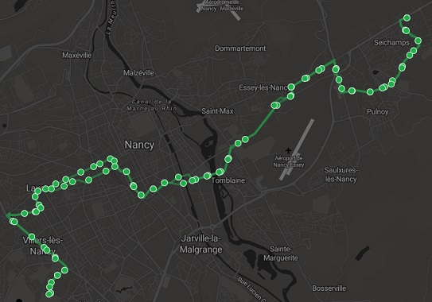

<!-- README.md is generated from README.Rmd. Please edit that file -->

# osmbus

**osmbus** is an R package which exports
[OpenStreetMap](https://www.openstreetmap.org) public transport lines to
GPX files.

You can install it from github with :

``` r
# install.packages("devtools")
devtools::install_github("py-b/osmbus")
```

Note : *on Windows*, you need to have
[RTools](https://cran.r-project.org/bin/windows/Rtools) to make
{devtools} work.

### Just give me my GPX file

You only have to provide the identifier of the OpenStreetMap relation of
the transport line.

For example, we want to export [this bus
line](https://www.openstreetmap.org/relation/3220296) (near Nancy,
France) :

``` r
write_gpx(id_rel = "3220296")
```

As recommended on the OSM wiki, the ways in the relation should be
listed beginning with the way at the initial stop position and ending
with the way at the terminal stop, in the right order. **If this is not
the case, the function cannot work**. The package automatically reverses
certain ways to produce a continuous track.

If roundabouts (or any circular ways) are present, the package will find
its way through them, i.e. it will select the only nodes used by the
transport vehicle from entrance to exit.

##### Content of the file

  - metadata about the transport line : some retrieved from OSM (for
    example the version of the relation) and some calculated by the
    package (for example the length in kilometers) ;
  - position and names of the stops (`role = "stop"`) in the relation,
    as gps `wpt` ;
  - list of the points of the track, in the correct order, as gps
    `trkseg`.

It will be structured like this :

``` xml
<?xml version="1.0" encoding="UTF-8"?>
<gpx>
  <metadata>
    <osm_relation id="3220296" version="79" timestamp="2020-11-08T17:23:43Z">
      <colour>#20B14A</colour>
      <from>Seichamps Haie Cerlin</from>
      <name>Tempo 3 : Seichamps Haie Cerlin → Villers Campus Sciences</name>
      <network>Stan</network>
      <operator>Transdev</operator>
      <ref>Tempo 3</ref>
      <route>bus</route>
      <to>Villers Campus Sciences</to>
      <type>route</type>
    </osm_relation>
    <bounds minlat="48.6634437" minlon="6.1424778" maxlat="48.7196149" maxlon="6.2695481"/>
    <wpt_count>46</wpt_count>
    <trkpt_count>946</trkpt_count>
    <trk_km>17.402</trk_km>
    <copyright attribution="http://www.openstreetmap.org/copyright"/>
  </metadata>
  <wpt lat="48.7195418" lon="6.2657901">
    <name>Seichamps Haie Cerlin</name>
  </wpt>
  <wpt lat="48.7169089" lon="6.2656034">
    <name>Seichamps Église</name>
  </wpt>
  <!-- .... other way points ... -->
  <wpt lat="48.6635161" lon="6.1561497">
    <name>Villers Campus Sciences</name>
  </wpt>
  <trk>
    <trkseg>
      <trkpt lat="48.7195418" lon="6.2657901" osm_node="3163674258" version="1"/>
      <trkpt lat="48.7195728" lon="6.2657585" osm_node="3163674481" version="2"/>
      <trkpt lat="48.71959" lon="6.2657147" osm_node="3070509280" version="3"/>
      <!-- ... other track points ... -->
      <trkpt lat="48.663529" lon="6.1559462" osm_node="4455689648" version="1"/>
      <trkpt lat="48.6635161" lon="6.1561497" osm_node="1650185781" version="6"/>
    </trkseg>
  </trk>
</gpx>
```

### Example of use

With the gpx file, you are a few steps away from creating a map like
[this](http://u.osmfr.org/m/218270).

<a href="http://u.osmfr.org/m/218270/"></a>

*(this map was not made with R but with an interactive tool called
[uMap](http://umap.openstreetmap.fr))*

### Get the underlying data into R

It is also possible to get the intermediate data that was used to
generate the gpx file (this can be useful to do something else than
exporting to GPX).

``` r
extract_data(id_rel = "3220296")
#> $bounds
#>    minlat    minlon    maxlat    maxlon 
#> 48.663444  6.142478 48.719615  6.269548 
#> 
#> $rel_tags
#>                                                      colour 
#>                                                   "#20B14A" 
#>                                                        from 
#>                                     "Seichamps Haie Cerlin" 
#>                                                        name 
#> "Tempo 3 : Seichamps Haie Cerlin <U+2192> Villers Campus Sciences" 
#>                                                     network 
#>                                                      "Stan" 
#>                                                    operator 
#>                                                  "Transdev" 
#>                                                         ref 
#>                                                   "Tempo 3" 
#>                                                       route 
#>                                                       "bus" 
#>                                                          to 
#>                                   "Villers Campus Sciences" 
#>                                                        type 
#>                                                     "route" 
#> 
#> $rel_attr
#>                     id                version              timestamp 
#>              "3220296"                   "79" "2020-11-08T17:23:43Z" 
#>              changeset                    uid                   user 
#>             "93750625"              "1075986"           "py_berrard" 
#> 
#> $stop_count
#> [1] 46
#> 
#> $trkpt_count
#> [1] 946
#> 
#> $trk_km
#> [1] 17.402
#> 
#> $stop_base
#> # A tibble: 46 x 5
#>    id         name                    lat   lon version
#>    <chr>      <chr>                 <dbl> <dbl> <chr>  
#>  1 3163674258 Seichamps Haie Cerlin  48.7  6.27 1      
#>  2 3163519911 Seichamps Église       48.7  6.27 1      
#>  3 966281833  Donon                  48.7  6.27 2      
#>  4 3163208966 Jardin Roussel         48.7  6.27 1      
#>  5 3140811791 Semoir                 48.7  6.26 1      
#>  6 963538950  Collège Goncourt       48.7  6.26 2      
#>  7 3065252842 Blés d'Or              48.7  6.26 2      
#>  8 962186695  Charles de Gaulle      48.7  6.25 3      
#>  9 3414202098 Renaissance            48.7  6.25 2      
#> 10 3138716806 Porte Verte            48.7  6.24 2      
#> # ... with 36 more rows
#> 
#> $trkpt_base
#> # A tibble: 946 x 5
#>    id           lat   lon version d_last
#>    <chr>      <dbl> <dbl> <chr>    <dbl>
#>  1 3163674258  48.7  6.27 1         0   
#>  2 3163674481  48.7  6.27 2         4.16
#>  3 3070509280  48.7  6.27 3         3.74
#>  4 3163674482  48.7  6.27 2         6.68
#>  5 3070509345  48.7  6.27 3         4.95
#>  6 65074447    48.7  6.27 3        12.7 
#>  7 3163674477  48.7  6.27 2        23.3 
#>  8 3163674476  48.7  6.27 1         2.94
#>  9 4720935403  48.7  6.26 1        88.5 
#> 10 4720935406  48.7  6.26 1         5.41
#> # ... with 936 more rows
```

*(`d_last` in the `trkpt_base` data.frame gives the distance to the
previous point, in meters)*

> If you wish to both export to a file and keep the data, you can affect
> the result of `write_gpx()` to an objet :
> 
> ``` r
> bus_data <- write_gpx(id_rel = "3220296")
> ```

### Overpass API

The data is retrieved from OpenStreetMap using the [overpass
API](https://wiki.openstreetmap.org/wiki/Overpass_API).

You can choose which instance of the API is used via the `overpass_url`
argument of the functions. By default, the main instance
`"http://overpass-api.de/api/interpreter"` is used. See the link above
for a list of available instances.

Note that this read-only API can be a few minutes behind the editing
API.
